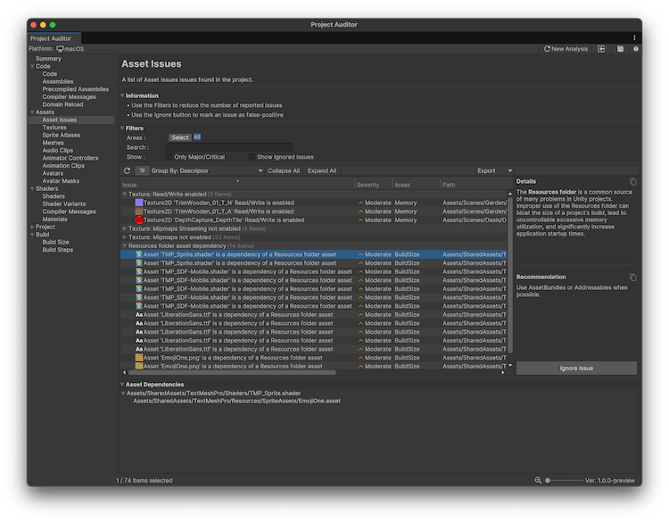

# Assets view reference

The Assets view displays issues and information related to the assets in your project. You can select from the following views:

* [Asset Issues](#asset-issues-view)
* [Textures](#textures-view)
* [Sprite Atlases](#sprite-atlases-view)
* [Meshes](#meshes-view)
* [Audio Clips](#audio-clips-view)
* [Animator Controllers](#animator-controllers-view)
* [Animation Clips](#animation-clips-view)
* [Avatars](#avatars-view)
* [Avatar Masks](#avatar-masks-view)

## Asset Issues view

The Assets Issues view reports asset-related issues. For each issue, this view also provides an explanation of the problem and a recommended course of action to resolve the issue.

 _Project Auditor window with the Assets Issues view open_

### Table

The table of issues has the following columns. Use the [table controls](project-auditor-window-reference.md#table-controls) to configure how to organize and display the data.

|**Property**|**Description**|
|---|---|
|**Issue**|Summary of the issue. Right-click on the issue to open its relevant code file, or open the documentation where possible.|
|**Severity**|An estimate of the severity of the issue. Severity can be Major, Moderate, Minor, or Ignored.|
| **Areas**   | The area of performance that this issue affects. Area can be Build Size, Memory, Quality, CPU, or GPU performance.|
| **Path**    | The full path and file name of the asset in which the issue was found. Double-click on any issue to select the corresponding asset in the Project window to view it in the Inspector. |
|**Descriptor**|Categorizes the issue with this code.|
|**Ignored**|Displays True if the issue is ignored. To ignore an issue, choose it in the list and then select **Ignore Issue** in the **Details** panel to the right. To display ignored issues, select **Show Ignored Issues** in the **Filters** panel.|

### Asset Dependencies

For Assets Issues relating to dependency chains, the Asset Dependencies panel at the bottom of the window displays an asset dependency tree. At the root level of the tree is the asset itself. Expanding the tree one level displays all of the assets that reference that asset.

## Textures view

Displays all textures in the project's Assets folder, along with their properties and asset import
settings.

The table of issues has the following columns. Use the [table controls](project-auditor-window-reference.md#table-controls) to configure how to organize and display the data.

|**Property**|**Description**|
|---|---|
| **Name**          | The texture file name.|
| **Shape**         | The [`TextureImporterShape`](xref:UnityEditor.TextureImporterShape): Texture2D, TextureCube, Texture2DArray or Texture3D. |
| **Importer Type** | The [`TextureImporterType`](xref:UnityEditor.TextureImporterType) selected in the texture's Importer settings.  |
| **Format**        | The texture format of the imported texture asset on the analysis target platform.  |
| **Compression**   | The [`TextureImporterCompression`](xref:UnityEditor.TextureImporterCompression) option for the analysis target platform. By default, this is the value set in the Default tab of the importer, but can be overridden on the Platform tab. |
| **MipMaps**       | Indicates whether the **Generate Mip Maps** setting is enabled in the import settings.      |
| **Readable**      | Indicates whether the **Read/Write Enabled** setting is enabled in the import settings.  |
| **Resolution**    | Resolution of the imported texture asset. This value might be different from the source asset resolution depending on the import settings.|
| **Size**          | File size of the imported texture asset.  |
| **Streaming**     | Indicates whether the **Streaming Mipmaps** setting is enabled in the import settings.  |
| **Path**          | The full path to the source asset within the Assets folder.  |

## Sprite Atlases view

Displays all Sprite Atlases in the project's Assets folder.

The table of issues has the following columns. Use the [table controls](project-auditor-window-reference.md#table-controls) to configure how to organize and display the data.

|**Property**|**Description**|
|---|---|
|**Name**|The sprite atlas file name.|
|**Empty Space**|The percentage of the atlas which is empty pixels.|
|**Resolution**|Main texture resolution.|
|**Sprites**|Number of sprites.|
|**In Build**|Indicates if the atlas is included in the build|
|**Readable**|Indicates if the atlas is read/write.|
|**MipMaps**|Indicates if the Texture MipMaps setting is enabled.|
|**Padding**|Number of pexels of padding.|
|**Path**|File path of the sprite atlas.|

## Meshes view

Displays all mesh assets in the project's Assets folder, along with their properties and asset import settings.

The table of issues has the following columns. Use the [table controls](project-auditor-window-reference.md#table-controls) to configure how to organize and display the data.

|**Property**|**Description**|
|---|---|
| **Name**           | The file name of the source FBX file containing this mesh. Note that FBX files can contain multiple meshes, so a single FBX file can be responsible for multiple rows in the table. To group meshes by FBX, select **Show Hierarchy** and choose **Group By: Path** from the drop-down. |
| **Vertex Count**   | The number of vertices in the mesh.  |
| **Triangle Count** | The number of triangles in the mesh.   |
| **Compression**    | The [`ModelImporterMeshCompression`](xref:UnityEditor.ModelImporterMeshCompression) option selected in the mesh import settings.  |
| **Size**           | File size of the imported mesh asset.  |
| **Path**           | The full path to the source asset within the Assets folder. |

## Audio Clips view

Displays all AudioClip assets in the project's Assets folder, along with their properties and asset import settings.

The table of issues has the following columns. Use the [table controls](project-auditor-window-reference.md#table-controls) to configure how to organize and display the data.

|**Property**|**Description**|
|---|---|
| **Name**                    | The AudioClip file name. |
| **Format**                  | The file format of the source audio file.  |
| **Length**                  | The duration of the AudioClip, in the format `minutes:seconds.milliseconds`.   |
| **Source File Size**        | The source asset file size. |
| **Imported File Size**      | The imported AudioClip asset file size.  |
| **Runtime Size (Estimate)** | An estimate of the runtime memory footprint of one instance of this AudioClip, if it is playing. Includes estimated sizes of buffers for decompression and streaming, if the AudioClip requires them. |
| **Compression Ratio**       | Compression ratio, calculated from the Source File Size and Imported File Size.  |
| **Compression Format**      | The compression format of the imported AudioClip asset. |
| **Sample Rate**             | The imported AudioClip's sample rate, in hertz (Hz) or kilohertz (kHz). |
| **Force To Mono**           | Whether the **Force To Mono** setting is enabled in the import settings. |
| **Load In Background**      | Whether the **Load In Background** setting is enabled in the import settings. |
| **Preload Audio Data**      | Whether the **Preload Audio Data** setting is enabled in the import settings. |
| **Load Type**               | The [`AudioClipLoadType`](xref:UnityEngine.AudioClipLoadType) selected in the import settings: DecompressOnLoad, CompressedInMemory or Streaming. |
| **Path**                    | The full path to the source asset within the Assets folder.   |

## Animator Controllers view

Displays all Animator Controller assets in the project's Assets folder, along with their properties and asset import settings.

The table of issues has the following columns. Use the [table controls](project-auditor-window-reference.md#table-controls) to configure how to organize and display the data.

|**Property**|**Description**|
|---|---|
| **Name**    | The Animator Controller asset file name.                             |
| **Layers**    | The number of layers the Animator Controller contains.               |
| **Params**    | The number of parameters the Animator Controller contains.           |
| **Clips**     | The number of Animation Clips referenced in the Animator Controller. |
| **Size**      | File size of the Animator Controller asset.                          |
| **Path**      | The full path to the asset within the Assets folder.                 |

## Animation Clips view

Displays all animation clip assets in the project's Assets folder, along with their properties and asset import settings.

The table of issues has the following columns. Use the [table controls](project-auditor-window-reference.md#table-controls) to configure how to organize and display the data.

| **Property** | **Description** |
| :---- | :---- |
| **Name** | The Animation Clip file name. |
| **Empty** | Displays a tick if the animation contains no curves and no events. |
| **Events** | The number of events in the Animation Clip. |
| **Frame Rate**| The frame rate used in the animation program used to create the animation. |
| **Length** | Animation length, in seconds. |
| **Wrap Mode** | The Animation Clip's Wrap Mode. |
| **Looping** | Displays a tick if the animation loops. |
| **Generic Root Transform** | Displays a tick if the animation includes animation of the root transform. |
| **Motion Curves** | Displays a tick if the animation has root motion curves. |
| **Motion Float Curves** | Displays a tick if the animation has editor curves for its root motion. |
| **Root Curves**| Displays a tick if the animation has root curves. |
| **Human Motion** | Displays a tick if the animation contains curves that drive a humanoid rig. |
| **Legacy** | Displays a tick if the animation clip is used with a Legacy Animation component. |
| **Size** | File size of the imported Animation Clip asset. |
| **Path** | The full path to the source asset within the Assets folder.   |

## Avatars view

Displays all Avatar assets in the project's Assets folder, along with their properties and asset import settings.

The table of issues has the following columns. Use the [table controls](project-auditor-window-reference.md#table-controls) to configure how to organize and display the data.

| **Property** | **Description** |
| :---- | :---- |
| **Name** | The Avatar asset file name. |
| **Valid** | Displays a tick if the Avatar is a valid mecanim avatar. It can be a generic avatar or a human avatar. |
| **Human** | Displays a tick if the Avatar is a valid human avatar. |
| **Human Bones** | If the Avatar is human, displays the number of mappings between Mecanim bones names and bone names in the rig. |
| **Skeleton Bones** | If the Avatar is human, displays the number of bone Transforms in the model. |
| **Upper Arm Twist** | If the Avatar is human, displays how much rotation is applied to the shoulder and elbow. A twist of 0 applies entirely to the shoulder, 1 applies entirely to the elbow. |
| **Lower Arm Twist** | If the Avatar is human, displays how much rotation is applied to the wrist and elbow. A twist of 0 applies entirely to the elbow, 1 applies entirely to the wrist. |
| **Upper Leg Twist** | If the Avatar is human, displays how much rotation is applied to the thigh and knee. A twist of 0 applies entirely to the this, 1 applies entirely to the knee. |
| **Lower Leg Twist** | If the Avatar is human, displays how much rotation is applied to the knee and ankle. A twist of 0 applies entirely to the knee, 1 applies entirely to the ankle. |
| **Arm Stretch** | If the Avatar is human, displays the amount by which arms are allowed to stretch to reach targets when using Inverse Kinematics (IK). |
| **Leg Stretch** | If the Avatar is human, displays the amount by which legs are allowed to stretch to reach targets when using Inverse Kinematics (IK). |
| **Feet Spacing** | If the Avatar is human, displays the minimum distance between the avatar's feet during IK movement. |
| **Translation DoF** | displays a tick if the Avatar is human and has a translation Degree of Freedom (DoF) on its Spine, Chest, Neck, Shoulder or Upper Leg bones. |
| **Size** | File size of the imported Avatar asset. |
| **Path** | The full path to the source asset within the Assets folder. |

## Avatar Masks view

Displays all Avatar Mask assets in the project's Assets folder, along with their properties and asset import settings.

The table of issues has the following columns. Use the [table controls](project-auditor-window-reference.md#table-controls) to configure how to organize and display the data.

| **Property** | **Description** |
| :---- | :---- |
| **Name**       | The Avatar Mask file name.                                                       |
| **Transforms** | The number of transforms in the Avatar Mask.                                     |
| **Size**       | An estimate of the runtime memory footprint of one instance of this Avatar Mask. |
| **Path**       | The full path to the source asset within the Assets folder.                      |

## Additional resources

* [Analyze your project](analyze-project.md)
* [Project Auditor window reference overview](project-auditor-window-reference.md)