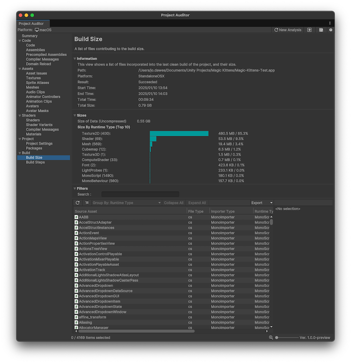
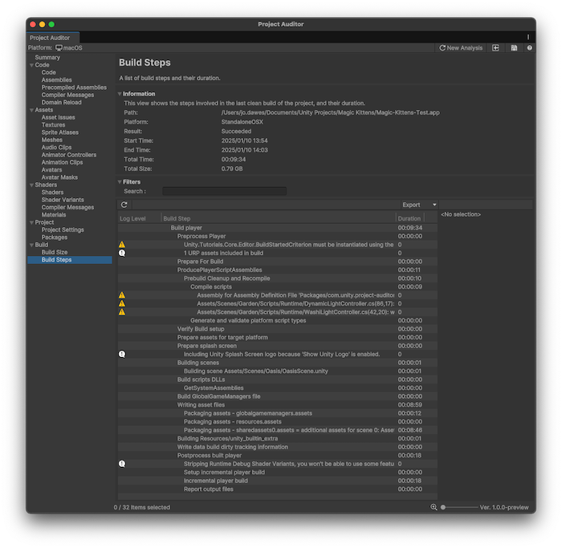

# Build view reference

Contains information about the build size and compilation steps of your project. This area contains the following views:

* [Build Size](#build-size-view)
* [Build Steps](#build-steps-view)

## Build Size view

Displays the file sizes of all of the assets that were included in the last clean [`BuildReport`](xref:UnityEditor.Build.Reporting.BuildReport).

A clean build is important for capturing accurate information about build sizes and steps. For this reason, Project Auditor doesn't display the results of incremental builds.

To create a clean build, follow these steps:
* Open the **File > Build Settings** window.
* Next to the **Build button**, select the drop-down.
* Select **Clean Build**.

If your project uses a custom build script, ensure that it passes the `BuildOptions.CleanBuildCache` option to `BuildPipeline.BuildPlayer`.

 _Project Auditor window with the Build Size view open_

### Information panel

The Information panel contains details of the Build Report which the asset file data was extracted from. This also includes an additional **Sizes** panel which displays a summary of the total size of the asset data and a breakdown of the largest asset categories arranged by runtime type. This can help to prioritise areas of investigation if you want to reduce your application's download/install size.

### Table

The table of issues has the following columns. Use the [table controls](project-auditor-window-reference.md#table-controls) to configure how to organize and display the data.

|**Property**|**Description**|
| :---- | :---- |
| **Source Asset**     | The file name of the source asset. |
| **File Type**        | The file type of the source asset.     |
| **Importer Type**    | The type of importer used to process the source asset into its runtime type. |
| **Runtime Type**     | The runtime type of the asset. For example, a .png image file that was imported by the `TextureImporter` to create a `Texture2D`. |
| **Size**             | File size of the imported asset.  |
| **Size % (of Data)** | File size of the imported asset, as a percentage of the combined size of all the assets which were include in the build.  |
| **Build File**       | The file name of the archive file which the imported asset was packed into.   |

## Build Steps view

Displays all the build steps from the last clean [`BuildReport`](xref:UnityEditor.Build.Reporting.BuildReport) and how long each step took.

 _Project Auditor window with the Build Steps view open_

### Information panel

The Information panel contains details of the Build Report which the asset file data was extracted from.

### Table

The table differs slightly from the ones in other Views. It represents an ordered hierarchical list of build steps, indented to show sub steps. Because of this table formatting, you can't sort the table by column, and several buttons in the table view controls aren't displayed in this View.

|**Property**|**Description**|
| :---- | :---- |
| **Log Level**   | The log level of the build message (Error/Warning/Info). |
| **Build Step**  | The build report log message. Info messages describe the build step itself, Warning/Error messages indicate problems that were encountered during the build. |
| **Duration**    | The time taken by this build step and its sub tasks.  |

## Additional resources

* [Analyze your project](analyze-project.md)
* [Project Auditor window reference overview](project-auditor-window-reference.md)