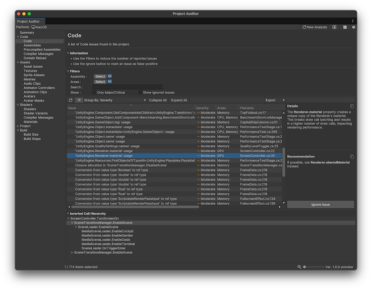

# Code view reference

The Code view displays issues related to the C# code in your project. This view is divided into the following screens:

* [Code](#code-view)
* [Assemblies](#assemblies-view)
* [Precompiled Assemblies](#precompiled-assemblies)
* [Compiler Messages](#compiler-messages)
* [Domain Reload](#domain-reload-view)

## Known limitations
There are several known limitations in Project Auditor's code analysis:
* It reports issues in code that might be stripped by the build process.
* It can't distinguish between different versions of an API method with different parameters/return types: for example, it can't differentiate between the following, so it reports both:

    * `public Component[] GetComponentsInChildren(Type type, bool includeInactive = false);` (which allocates managed memory)
    * `public void GetComponentsInChildren(List<T> results);` (which doesn't allocate memory)
* It can't distinguish between "hot" and "cold" code paths, except by checking if a method is in (or is a called by) one of the standard `MonoBehaviour (Fixed/Late)Update` methods, or `SystemBase/ISystem.OnUpdate`, or a coroutine.
* The call tree analysis doesn't support virtual methods.

## Code view
The Code Issues view reports all C# script-related issues. For each issue, this view also provides an explanation of the problem and a recommended course of action to resolve the issue.

 _Project Auditor window with the Code view open_

### Filters

Use the filters to filter the list of issues to areas you're interested in. For more information, refer to [Filter controls](project-auditor-window-reference.md#filter-controls).

Enable the **Only Major/Critical** setting to display only code issues that have an inverted call hierarchy that includes an update method. For example [coroutine methods](xref:um-coroutines), or built-in methods such as `MonoBehaviour.Update()`,`MonoBehaviour.FixedUpdate()`, `SystemBase.OnUpdate()`, `ISystem.OnUpdate()`, among others.

This allows you to focus on issues that are more likely to happen in code paths that are called every frame. Code in these paths is more likely to have an impact on runtime performance or memory management than code which runs only during initialization.

### Table

The table of issues has the following columns. Use the [table controls](project-auditor-window-reference.md#table-controls) to configure how to organize and display the data.

|**Property**|**Description**|
|---|---|
|**Issue**|Summary of the issue. Right-click on the issue to open its relevant code file, or open the documentation where possible.|
|**Severity**|An estimate of the severity of the issue. Severity can be Major, Moderate, Minor, or Ignored. All issues found in code paths that are called every frame are automatically marked as Major.|
|**Area**|The area of performance that this issue affects. Area can be CPU, Memory, or both.|
|**Filename**|The name of the file that this issue occurred in, along with the line number. Double-click the issue to open it in your IDE.|
|**Assembly**|The name of the assembly the code file is a part of.|
|**Descriptor**|Categorizes the issue with this code.|
|**Ignored**|Displays True if the issue is ignored. To ignore an issue, choose it in the list and then select **Ignore Issue** in the **Details** panel to the right. To display ignored issues, select **Show Ignored Issues** in the **Filters** panel.|

### Details panel

When you select an issue, the Details panel to the right displays a summary of why the selected item is an issue, and a recommendation of steps to take to resolve the issue. If the item isn't an issue for your project, select **Ignore Issue** to exclude it.

### Inverted Call Hierarchy

The Inverted Call Hierarchy panel displays an inverted call hierarchy for the selected issue in the table. Expand the tree to display all the methods that lead to the call site of the reported issue. The panel only displays an inverted call hierarchy if code analysis was performed during this Editor session. Call hierarchies aren't saved in reports.

## Assemblies view

Reports a list of all compiled assemblies. This includes all assemblies generated by code in the Assets folder and in packages.

### Table

The table of issues has the following columns. Use the [table controls](project-auditor-window-reference.md#table-controls) to configure how to organize and display the data.

|**Property**|**Description**|
| :---- | :---- |
| **Log Level** | The log level of the message (Error/Warning/Info).|
| **Assembly Name** | The name of the assembly. |
| **Compile Time** | The time in ms it took to compile the assembly in preparation for code analysis when generating the report. |
| **Read Only** | Displays whether the source files of an assembly can be modified in the project. Packages installed from a registry or from a repository are typically Read Only. |
| **Asmdef path** | The full path to the assembly definition file for this assembly. |

### Dependencies panel

The Dependencies panel displays a list of any dependencies that the assembly has.

## Precompiled Assemblies

Displays a list of the precompiled assemblies in your project.

|**Property**|**Description**|
| :---- | :---- |
|**Assembly Name**| The name of the assembly.|
|**Roslyn Analyzer**|The related Roslyn analyzer, if any.|
|**Path**|The path to the precompiled assembly.|

## Compiler Messages

Displays the compiler error, warning, and info messages. The C# compiler generates these messages when compiling the project scripts for the target platform.

>[!IMPORTANT]
>To populate this view with data, you must enable the **Use Roslyn Analyzers** setting in the [Preferences window](project-auditor-settings-reference.md). Additionally, you must have one or more Roslyn analyzer DLL files in your project, tagged with the `RoslynAnalyzer` label. To add a label, select the DLL file, and add the `RoslynAnalyzer` Asset Label. For more information, refer to the [Unity User Manual](xref:um-roslyn-analyzers).

### Table

The table of issues has the following columns. Use the [table controls](project-auditor-window-reference.md#table-controls) to configure how to organize and display the data.

|**Property**|**Description**|
| :---- | :---- |
| **Log Level** | The log level of the compiler message (Error/Warning/Info). |
| **Code** | The error/warning code reported by the compiler. |
| **Message** | The error/warning message string reported by the compiler. Select an item in the table to display the full message in the panel to the right. |
| **Filename** | The name of the file that this issue occurred in, along with the line number. Double-click the issue to open it in your IDE.|
| **Target Assembly** | The assembly which contains the file that generated the message. The default assembly for user code in a Unity project is called Assembly-CSharp. |
| **Full Path** | The full path to the code file that generated the message. |

## Domain Reload view

Displays the results of a Roslyn analyzer that detects code issues that results in unexpected or non-deterministic behavior if domain reload is disabled in your project. Domain reloading can impact project iteration times (in particular, the time it takes to enter and exit Play mode), so it's best practice to fix all the issues displayed in this view and then to disable domain reload. For more information, refer to [Domain reloading](domain-reloading-issues.md).

>[!IMPORTANT]
>To populate this view with data, you must enable the **Use Roslyn Analyzers** setting in the [Preferences window](project-auditor-settings-reference.md).

## The View table

The table of issues has the following columns. Use the [table controls](project-auditor-window-reference.md#table-controls) to configure how to organize and display the data.

|**Property**|**Description**|
| :---- | :---- |
| **Code**     | The error/warning code reported by the compiler.|
| **Issue**    | The error/warning message string reported by the compiler. Select an item in the table to display the full message in the panel to the right.|
| **Filename** | The name of the file that this issue occurred in, along with the line number. Double-click the issue to open it in your IDE. |
| **Assembly** | The assembly which contains the file that generated the message. The default assembly for user code in a Unity project is called Assembly-CSharp. |

## Additional resources

* [Analyze your project](analyze-project.md)
* [Project issues](project-issues.md)
* [Domain reloading issues](domain-reloading-issues.md)