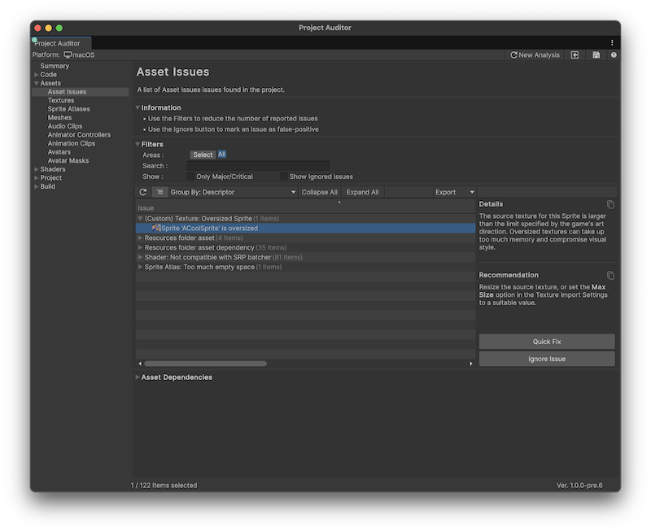

# Creating custom analyzers

Project Auditor provides an API for creating custom analyzers tailored to the needs of your project.

Internally, Project Auditor creates and maintains the following modules:

* Animation
* Assets
* AudioClip
* BuildReport
* Code
* Mesh
* Packages
* Settings
* Shader
* SpriteAtlas
* Texture

Every module has a corresponding class inheriting from [`ModuleAnalyzer`](xref:Unity.ProjectAuditor.Editor.Core.ModuleAnalyzer) which declares an `Analyze` method which takes a type inheriting from `AnalysisContext`. During analysis, the module uses reflection to detect and create instances of any Analyzer classes inheriting from its corresponding `ModuleAnalyzer`, then constructs `AnalysisContext` objects and passes them to the Analyzers.

## Create an analyzer

The following is an example showing how to create a custom Analyzer. Imagine a texture-heavy 2D game with a pixel art visual style. In such a project it might be desirable to enforce maximum sizes for sprite texture assets to help manage memory and to enforce a consistent visual resolution.

The example script demonstrates how to do the following:

* Declare and register a `Descriptor`, including its custom `Fixer`.
* Use `DiagnosticParameterAttribute` to declare a diagnostic parameter for use during analysis.
* Access the contents of the `context` structure passed to it to decide whether to report an issue.
* Create an issue, including specifying the [`IssueCategory`](xref:Unity.ProjectAuditor.Editor.IssueCategory) which dictates the view in which the issue appears and the information that is displayed in the Issue table.

```c#
using System;
using System.Collections.Generic;
using Unity.ProjectAuditor.Editor;
using Unity.ProjectAuditor.Editor.Core;
using UnityEditor;

// Inherit from TextureModuleAnalyzer to allow TextureModule to create and run an
// instance of this analyzer.
class CustomTextureAnalyzer : TextureModuleAnalyzer
{
    // Define our custom maximum sprite size
    const int k_MaxSpriteSize = 1024;

    // Data for constructing a descriptor.
    const string k_SpriteTooBigId = "PAA9000";  // Make sure this ID is unique.
    const string k_Title = "(Custom) Texture: Oversized Sprite";
    const Areas k_ImpactedAreas = Areas.Memory | Areas.Quality;
    const string k_Description =
        "The source texture for this Sprite is larger than the limit specified by " +
        "the game's art direction. Oversized textures can take up too much memory " +
        "and compromise visual style.";
    const string k_Recommendation =
        "Resize the source texture, or set the <b>Max Size</b> option in the " +
        "Texture Import Settings to a suitable value.";

    // Declare a Descriptor to describe the issue we want to report.
    static readonly Descriptor k_CustomSpriteTooBigDescriptor = new Descriptor
    (
        k_SpriteTooBigId,
        k_Title,
        k_ImpactedAreas,
        k_Description,
        k_Recommendation
    )
    {
        // As well as the constructor parameters above, this area can be used to set
        // the values of other Descriptor fields.

        // Project Auditor will format this message using the Name that's passed into
        // CreateIssue.
        MessageFormat = "Sprite '{0}' is oversized",

        // Optionally declare a delegate to fix the issue in a single button click.
        Fixer = (issue, analysisParams) =>
        {
            var textureImporter =
                AssetImporter.GetAtPath(issue.RelativePath) as TextureImporter;

            if (textureImporter != null)
            {
                textureImporter.maxTextureSize = k_MaxSpriteSize;
                textureImporter.SaveAndReimport();
            }
        }
    };

    // Declare m_CustomSpriteSizeLimit as a DiagnosticParam. Give the parameter a
    // unique name and a sensible default.
    [DiagnosticParameter("CustomSpriteSizeLimit", "Sprite Size Limit",
        "Warn if any sprites have a width or height greater than this value.", k_MaxSpriteSize)]
    int m_CustomSpriteSizeLimit;

    // Override the initialize method in order to pass the custom Descriptor to the
    // registerDescriptor Action so that ProjectAuditor knows about it.
    public override void Initialize(Action<Descriptor> registerDescriptor)
    {
        registerDescriptor(k_CustomSpriteTooBigDescriptor);
    }

    // Implementation of the custom Analyze coroutine method. In the case of a class
    // inheriting from TextureModuleAnalyzer, the AnalysisContext passed to this
    // method is a TextureAnalysisContext.
    public override IEnumerable<ReportItem> Analyze(TextureAnalysisContext context)
    {
        // Check to see if a texture is treated as a sprite, and check its dimensions
        if (context.Importer.textureType == TextureImporterType.Sprite &&
           (context.Texture.width > m_CustomSpriteSizeLimit ||
            context.Texture.height > m_CustomSpriteSizeLimit))
        {
            // Create the issue with the correct category, DescriptorId, name and path
            yield return context.CreateIssue(IssueCategory.AssetIssue,
                    k_CustomSpriteTooBigDescriptor.Id, context.Name)
                .WithLocation(context.Importer.assetPath);
        }
    }
}
```



## Debugging slow analyzers
The analysis for some issues might take a long time to run, particularly in a large project. The `Descriptor` for such issues might declare `Descriptor.IsEnabledByDefault` to be false to stop them running when running Project Auditor interactively in the Editor.

When running Project Auditor in a CI/CD environment you can re-enable analysis for these descriptors. Use `AnalysisParams.WithAdditionalDiagnosticRules` to add temporary `Rule` instances to increase the `Severity` of a Descriptor to anything other than `Severity.None` to re-enable analysis in this context.

## Writing Descriptor text

Use the following guidelines when writing the strings that appear in Descriptors for the Issues
the tool reports:

* Use bold for the name of APIs and settings options in both the description and the recommendation. Do this by adding `<b>` and `</b>` tags before and after the name.
* Don’t use rich text in title or `messageFormat` strings. No `<b>`bold`</b>` tags, for example. These fields don’t support rich text in the UI so it will look bad.

## Additional resources

* [Run Project Auditor from the command line](run-from-command-line.md)
* [Compare issues and insights](compare-issues.md)
