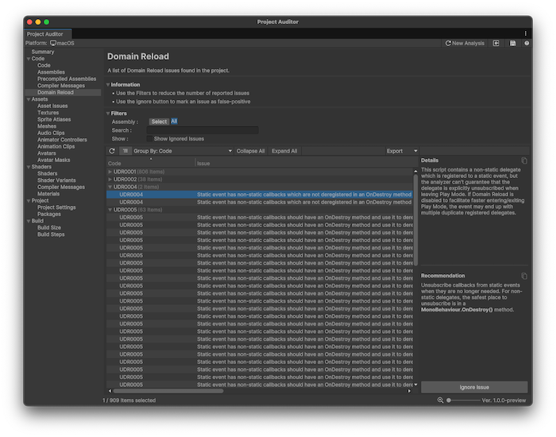

# Domain reloading issues

The [Domain Reload view](code-view-reference.md#domain-reload-view) displays the results of a Roslyn analyzer that detects code issues that result in unexpected or non-deterministic behavior if domain reload is disabled in your project. Domain reloading can impact project iteration times (in particular, the time it takes to enter and exit Play mode), so it's best practice to fix all the issues, and then disable domain reload.

## Domain reload overview

For an overview of what domain reload is and the effects of disabling it, refer to the Unity user manual documentation on [Code and scene reload on entering Play mode](xref:um-code-reloading-editor).

Project Auditor searches for the declaration of any static variables or events in a project. If it finds any, it then checks for the presence of a method with the `[RuntimeInitializeOnLoadMethod]` attribute. If such a method exists, its contents are analyzed to determine if the static variable or event is assigned to within its scope.

 _Project Auditor window with the Domain Reload view open_

Project Auditor raises warning diagnostics if any of the following criteria are met:

* No method with the `[RuntimeInitializeOnLoadMethod]` attribute exists.
* An analyzed variable isn't explicitly assigned within the `Initialize` method.
* An analyzed event isn't explicitly unsubscribed from within the `Initialize` method.

## Display domain reload issues

To display issues in the Domain Reload view, you need to enable the **Use Roslyn Analyzers** setting in the [Preferences window](project-auditor-settings-reference.md). The use of Roslyn analyzers can cause Project Auditor's analysis to take longer, so it's disabled by default.

To allow Project Auditor to use Roslyn analyzers:

1. Open the Preferences window (**Edit > Preferences** (macOS: **Unity > Settings**)).
1. Open the [Project Auditor preferences](project-auditor-settings-reference.md#preferences-reference).
1. Enable **Use Roslyn Analyzers**.

## Resolve domain reload issues

To resolve the issues reported in a C# script, you must do the following:

* Create an initialization method with the `[RuntimeInitializeOnLoadMethod]` attribute.
* For every static variable in the script, assign it a value within the scope of the initialization method.
* For every static event in the script, unsubscribe any methods that subscribe to the event.

## Additional resources

* [Code view reference](code-view-reference.md)
* [Code and scene reload on entering Play mode](xref:um-code-reloading-editor)