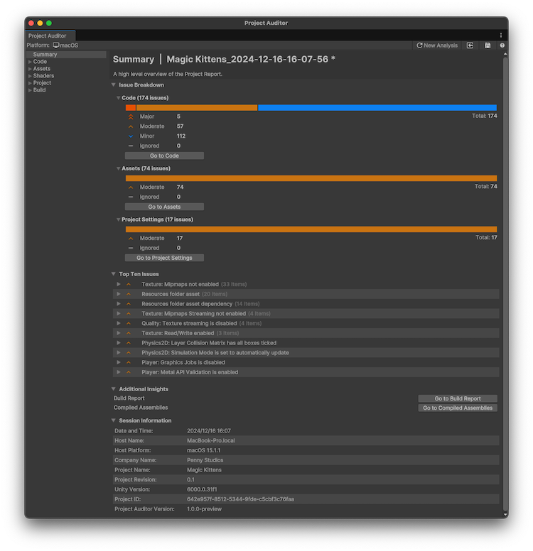

# Project Auditor introduction

Project Auditor is a tool that analyzes your project for any issues which it groups into the following areas:

* **Code issues:** A list of issues that affect performance, memory usage, Editor iteration times, and other areas related to the code in your project.
* **Asset issues:** A list of assets with import settings or file organization that impacts startup times, runtime memory usage, or performance.
* **Project settings issues:** A list of problems that might affect performance, memory, and other areas related to the settings in your project.
* **Build report insights:** How long each step of the last clean build took, and the assets included in it.

 _Project Auditor Summary view_

By default, Project Auditor performs a full analysis of your project with the target analysis platform set to the same build target in the Build Settings window. Code analysis runs on the main player assemblies. You can adjust the default settings in the [Preferences window](project-auditor-settings-reference.md#preferences-reference).

## Additional resources

* [Analyze your project](analyze-project.md)
* [Project Auditor window reference overview](project-auditor-window-reference.md)
