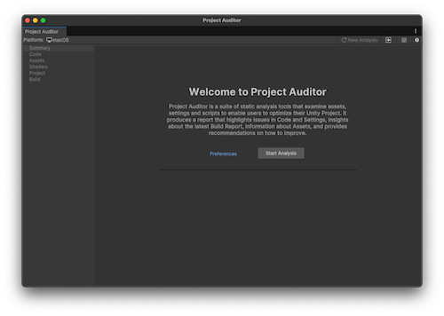
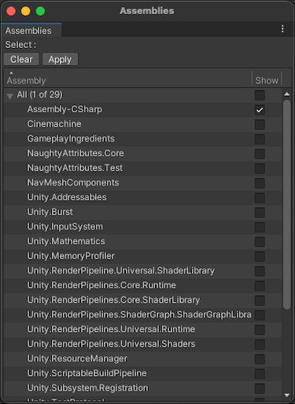

# Project Auditor window reference overview

To open the Project Auditor window, go to **Window > Analysis > Project Auditor**. When you open the window for the first time, it opens on the Welcome screen.

 _Project Auditor welcome screen_

## Toolbar

The Project Auditor window has a toolbar with the following buttons:

| **Value** | **Description** |
| :-------- | :-------------- |
|**⟳ New Analysis**| Discards the current report. The window then resets to the Welcome view to perform a new analysis.|
|**Load (square and arrow)**|Load a report from a saved file.|
|**Save (disk icon)**|Save a report to a .projectauditor file.|

## Project Area views

The panel on the left of the Project Auditor window contains a list of project areas which foldout. Once you have [analyzed your project](analyze-project.md), the foldouts on the left of the window populate with data. The project areas are as follows:

| **View** | **Description** |
| --------- | --------------- |
| **Summary**| Contains high-level information about the issues and insights Project Auditor found in your project,and about the analysis session and project itself. For more information, refer to [Summary view reference](summary-view-reference.md).|
| **Code**|A list of issues that affect performance, memory usage, Editor iteration times, and other areas related to the code in your project. For more information, refer to [Code view reference](code-view-reference.md)|
| **Assets**|A list of assets with import settings or file organization that impacts startup times, runtime memory usage, or performance.|
| **Shaders**|A list of shaders in your project, and any issues or compiler errors related to them.|
| **Project**|A list of problems that might affect performance, memory, and other areas related to the settings in your project.|
| **Build**|How long each step of the last clean build took, and the assets included in it.|

### Filter controls

Most Project Area views allow you to filter the data to areas that you want to focus on in the **Filters** panel. The following filter options are available:

| **Value** | **Description** |
| :-------- | :-------------- |
| **Search** | Filter the table with a string search. Type a search string into the text box and press return to display items that contain the search string.|
| **Assembly** (available in some code-related Project Area views)| Display code issues according to what assembly they were found in. The **Select** button opens an Assembly window where you can enable the assemblies you're interested in.|
|**Areas** (only available in some Project Area views) |Filter results by specific areas. The **Select** button opens an Areas window where you can enable the areas you're interested in.|
|**Show** (only available in some Project Area views)| Filter the results by issue type. Some views allow you to filter issues by severity. Enable or disable the checkboxes to include these issues.|

 _Assemblies window_

### Table controls

Each table contains the following controls so you can adjust how Project Auditor displays the issues:

| **Control** | **Description** |
| :---- | :---- |
| **Refresh (⟳)** | Re-run the analysis for this Project Area. |
| **Show/Hide Hierarchy** | Enable to display the table as a hierarchy according to the **Group By** dropdown. |
| **Group By** (only available when Show Hierarchy is enabled) | Select how to group the issues in the table. |
| **Collapse All** (only available when Show Hierarchy is enabled) | Collapse all expanded groups. |
| **Expand All** (only available when Show Hierarchy is enabled) | Expand all groups.|
| **Export** | Export the issues in the table to a comma-separated value (.csv) file. Choose from the following options:  - **All**: Export all issues in the current view. - **Filtered**: Export only the issues that are visible with the current filter settings. - **Selected**: Export only the selected issues. |

## Additional resources

* [Analyze your project](analyze-project.md)
* [Project issues](project-issues.md)