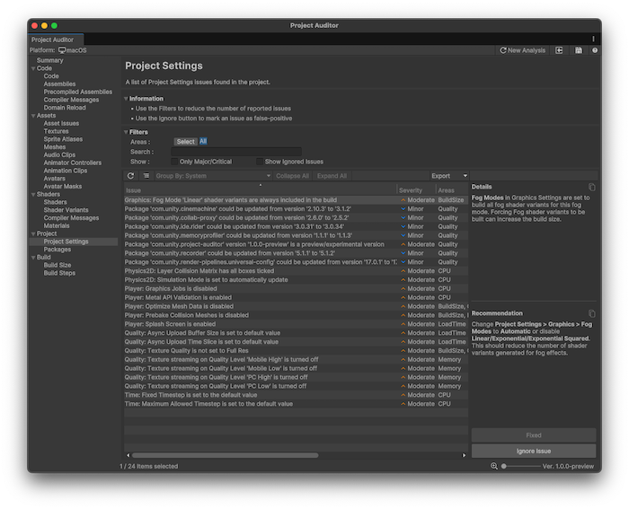

# Project view reference
Contains information about the project settings and packages in your project. The following views are available:

* [Project Settings](#project-settings-view)
* [Packages](#packages-view)

## Project Settings view

Displays issues found in the project's settings. For each issue, this view also provides an explanation of the problem and a recommended course of action to resolve the issue. For some issues, you can select **Quick Fix** from the panel on the right to automatically fix it. Alternatively, you can double-click on an issue in the table to be taken to the relevant page in the Project Settings window to examine and change settings yourself.

 _Project Auditor window with the Project Settings view open_

### Issue table

The table of issues has the following columns. Use the [table controls](project-auditor-window-reference.md#table-controls) to configure how to organize and display the data.

|**Property**|**Description**|
| :---- | :---- |
| **Issue**    | A brief description of the issue.  |
| **Severity** | An estimate of how severe the issue might be for your project (Critical/Major/Moderate/Minor). |
| **Areas**    | The area(s) affected by the issue. |
| **System**   | The feature or system which contains the setting related to this Issue. This corresponds to one of the items in the left panel of the Project Settings window.  |
| **Platform** | The build target(s) which this issue affects. Most issues are likely to exist across all platforms, but some issues only affect, or disproportionately affect, a smaller subset of Unity's supported platforms. |
|**Ignored**|Displays True if the issue is ignored. To ignore an issue, choose it in the list and then select **Ignore Issue** in the **Details** panel to the right. To display ignored issues, select **Show Ignored Issues** in the **Filters** panel.|

## Packages view

The Packages view displays a list of packages in your project, if you have enabled the [**Analyze Package Contents**](project-auditor-settings-reference.md#preferences-reference) setting in the Preferences window.

### Table

The table of issues has the following columns. Use the [table controls](project-auditor-window-reference.md#table-controls) to configure how to organize and display the data.

|**Property**|**Description**|
| :---- | :---- |
|**Package**|The name of the package.|
|**Name**|The package name as its known in the registry, for example `com.unity.project-auditor`.|
|**Version**|The installed version number of the package.|
|**Source**|The source for the package. For example, built-in, registry, or local.|
|**Path**|The install path of the package.|

## Additional resources

* [Analyze your project](analyze-project.md)
* [Project Auditor window reference overview](project-auditor-window-reference.md)