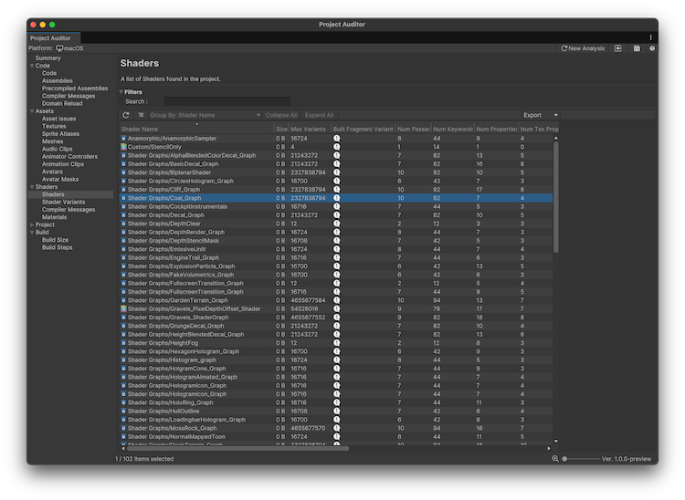
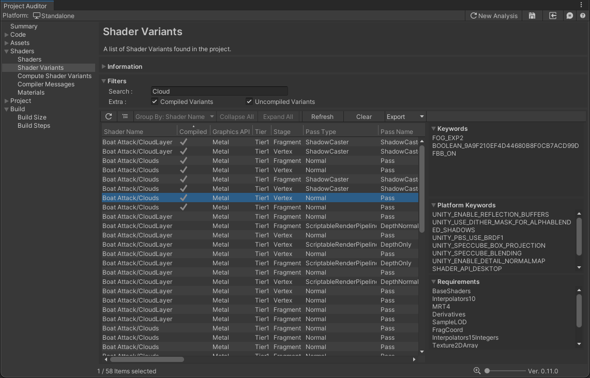

# Shaders view reference

The Shaders view displays information related to the shaders in your project and how they impact the performance of your project. You can select from the following views:

* [Shaders](#shaders-view)
* [Shader Variants](#shader-variants-view)
* [Compiler Messages](#compiler-messages-view)
* [Materials](#materials-view)

## Shaders view

 _Project Auditor window with the Shaders view open_

The table of issues has the following columns. Use the [table controls](project-auditor-window-reference.md#table-controls) to configure how to organize and display the data.

|**Property**|**Description**|
| :---- | :---- |
| **Shader Name** | The shader name, as declared inside the .shader file itself. For the actual asset file name, refer to the **Path** column. |
| **Size** | The file size of the shader, as reported in the most recent build report. Shaders that weren't included in the build are reported as being 0 bytes in size. |
| **Num Variants** | Number of potential shader variants for a single stage (for example: fragment), per rendering platform API (for example: Vulkan). This is the raw number of variants from considering keyword combinations, and contributes to build times and sizes. The build process might strip these variants down to a smaller number of variants that are actually included in the build. |
| **Built Fragment Variants** | Number of fragment shader variants per rendering platform API (for example: Vulkan) that were actually included in the build. |
| **Num Passes** | The number of passes included in this shader. |
| **Num Keywords** | The number of keywords referenced in this shader, including both globally keywords and local keywords declared in `#pragma` statements in this shader. |
| **Num Properties** | The number of properties in this shader. |
| **Num Tex Properties** | The number of properties in this shader which can hold a texture object. |
| **Render Queue** | The shader's render queue, which determines the order in which objects are rendered |
| **Instancing** | Displays a tick if any of this shader's passes enable GPU Instancing. Refer to [Creating shaders that support GPU instancing](xref:um-gpu-instancing-shader) for more information. |
| **SRP Batcher** | Displays a tick if this shader is compatible with the [Scriptable Render Pipeline batcher](xref:um-srp-batcher). |
| **Always Included** | Displays a tick if this shader is on the list of [Always Included Shaders](xref:um-class-graphics-settings) in the Graphics settings. |
| **Path** | The full path and file name of the source shader asset. |

## Shader Variants View

Displays all shader variants included in the build. Built-in shaders are included only after building the project for the target platform.

To populate the data in the table, build your project and then select the Refresh button (⟳).

 _Project Auditor window with the Shader Variants view open_

### Runtime shader compilation
To also view which Shader Variants were requested and compiled at runtime:

* Go to **Settings > Graphics > Shader Preloading** and enable **Log Shader Compilation**
* Ensure that the build you create is a Development build
* Run the build on the target platform. Be sure to test every scene and view in the build if you want to generate a complete list of compiled variants.
* Stop running the build, and locate the [`Player.log`](xref:um-log-files) file. Drag this file onto the Shader Variants View.

Project Auditor then parses the compilation log and populates the **Compiled** column.

### Issue table

The table of issues has the following columns. Use the [table controls](project-auditor-window-reference.md#table-controls) to configure how to organize and display the data.

|**Property**|**Description**|
| :---- | :---- |
| **Shader Name**       | The name of the shader that includes this shader variant.  |
| **Compiled**          | Shows a tick if this shader variant was compiled and used at runtime, as reported in a player log. |
| **Graphics API**      | The graphics API which this shader variant targets.   |
| **Tier**              | In the Built-in Render Pipeline, indicates the hardware tier that this shader variant targets. Refer to [Graphics tiers and shader variants](xref:um-graphics-tiers) for more information.  |
| **Stage**             | The stage in the rendering pipeline in which this shader variant runs. Refer to the [`ShaderType`](xref:UnityEditor.Rendering.ShaderType) API documentation for a full list of stages. |
| **Pass Type**         | The shader pass type in which this shader variant runs.Refer to the [`PassType`](xref:UnityEngine.Rendering.PassType) API documentation for more information.  |
| **Pass Name**         | The name of the shader pass in which this shader variant runs.   |
| **Keywords**          | A list of all the shader keywords that represent this specific shader variant. See the selected item detail panel to the right for an alternative view of this keyword list.   |
| **Platform Keywords** | A list of all the [`BuiltInShaderDefine`](xref:UnityEngine.Rendering.BuiltinShaderDefine) keywords set by the Editor for this shader variant. Refer to the selected item detail panel to the right for an alternative view of this keyword list. |
| **Requirements**      | A list of all the [`ShaderRequirements`](xref:UnityEditor.Rendering.ShaderRequirements) features required by this shader variant. Refer to the selected item detail panel to the right for an alternative view of this requirement list.         |

## Compiler Messages view

Displays shader compiler error and warning messages encountered during the build process.

The table of issues has the following columns. Use the [table controls](project-auditor-window-reference.md#table-controls) to configure how to organize and display the data.

|**Property**|**Description**|
| :---- | :---- |
| **Log Level**   | The log level of the compiler message (Error/Warning).  |
| **Message**     | The error/warning message string reported by the compiler. If you select a report item in the table, this message is displayed in the selected item detail panel to the right. |
| **Shader Name** | The name of the shader that generated the message. Double-click on any report item to automatically open the shader file or in a Shadergraph window.   |
| **Platform**    | The graphics API targeted by the shader.  |
| **Path**        | The full path and filename of the source shader asset that generated the message.  |

## Materials view

Displays all material assets in the project's Assets folder, along with their properties and asset
import settings.

>[!TIP]
>Enable the **Show/Hide hierarchy** button select **Group By: Shader** to easily see all of the materials that reference a particular shader.

The table of issues has the following columns. Use the [table controls](project-auditor-window-reference.md#table-controls) to configure how to organize and display the data.

|**Property**|**Description**|
| :---- | :---- |
| **Material Name** | The material file name.                                              |
| **Shader**        | The name of the shader referenced by this material.                  |
| **Source Asset**  | The full path to the source material asset within the Assets folder. |

## Additional resources

* [Analyze your project](analyze-project.md)
* [Project Auditor window reference overview](project-auditor-window-reference.md)